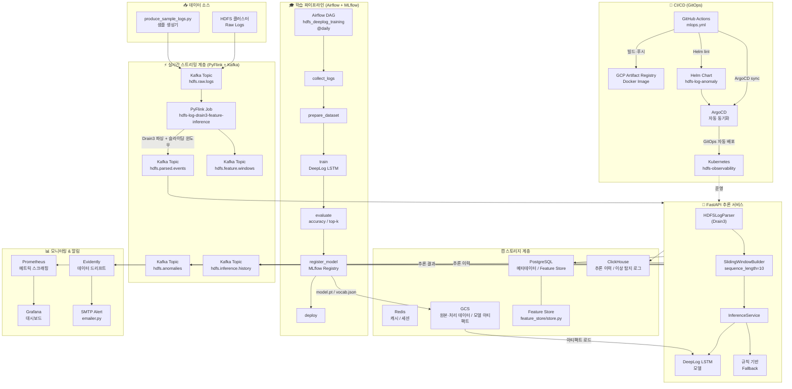
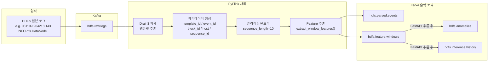
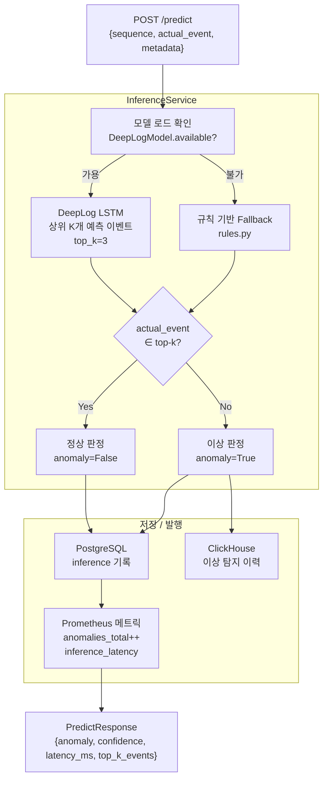
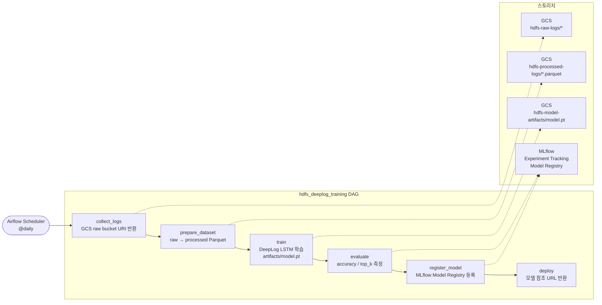
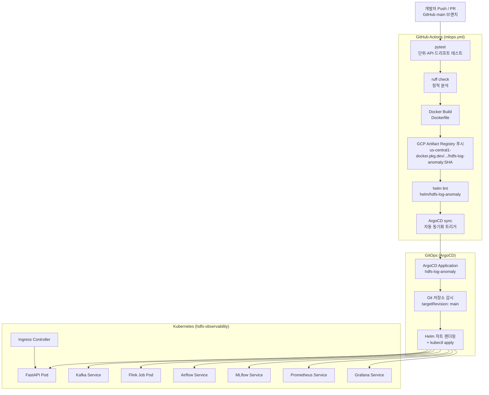
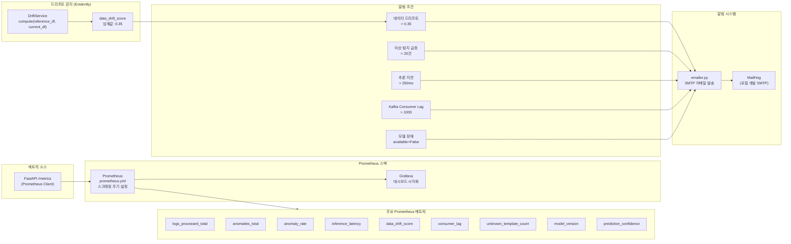
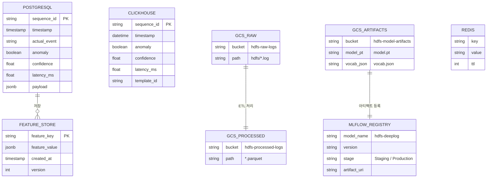
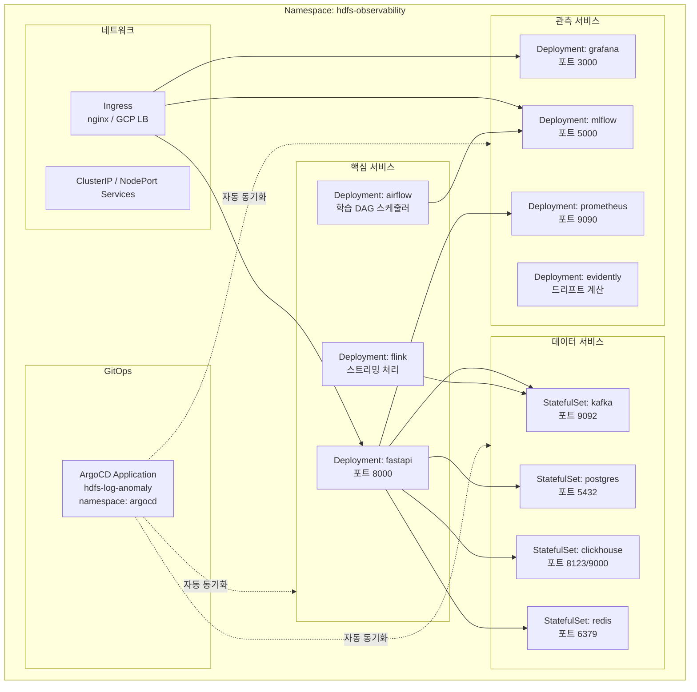
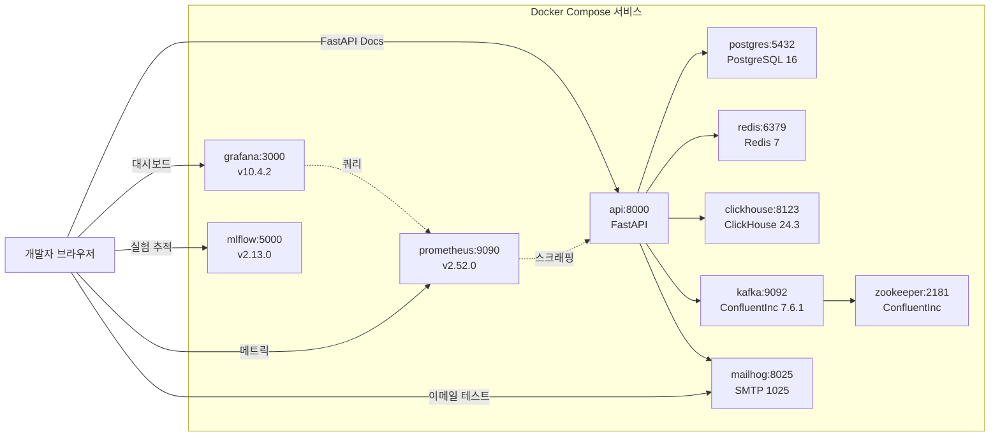
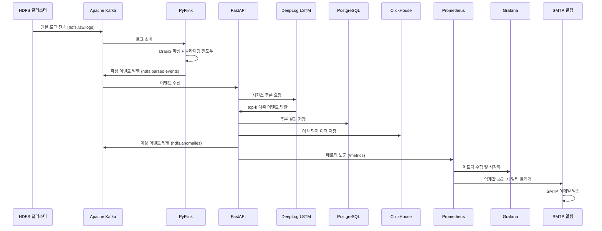

# HDFS 로그 이상 탐지 플랫폼 — 아키텍처 문서

> Kubernetes 기반 MLOps 플랫폼으로, HDFS 로그를 실시간으로 수집·파싱·추론하고  
> DeepLog LSTM 모델로 이상을 탐지합니다.

---

## 1. 전체 시스템 아키텍처

---

## 2. 실시간 스트리밍 파이프라인

---

## 3. 추론 서비스 내부 흐름

---

## 4. 학습 파이프라인 (Airflow DAG)

---

## 5. CI/CD 및 GitOps 배포 파이프라인

---

## 6. 모니터링 & 알림 아키텍처

---

## 7. 스토리지 계층 구성

---

## 8. Kubernetes 리소스 구성

---

## 9. 로컬 개발 환경 (Docker Compose)

---

## 10. 컴포넌트 책임 요약

| 컴포넌트 | 역할 | 기술 스택 |
|---|---|---|
| **FastAPI** | REST 추론 API, 파싱, 메트릭 노출 | Python, Uvicorn, Prometheus Client |
| **PyFlink** | 실시간 로그 스트리밍 처리 | Apache Flink, PyFlink |
| **Kafka** | 이벤트 버스 (5개 토픽) | Apache Kafka, Zookeeper |
| **Drain3** | 로그 템플릿 추출 파서 | Drain3 (UIUC) |
| **DeepLog** | LSTM 기반 이상 탐지 모델 | PyTorch |
| **Airflow** | 학습 파이프라인 스케줄러 | Apache Airflow, @daily DAG |
| **MLflow** | 실험 추적, 모델 레지스트리 | MLflow v2.13 |
| **PostgreSQL** | 메타데이터, Feature Store | PostgreSQL 16 |
| **ClickHouse** | 추론 이력, 대용량 로그 분석 | ClickHouse 24.3 |
| **Redis** | 캐시, 세션 상태 | Redis 7 |
| **GCS** | 원본 로그, 처리 데이터, 모델 아티팩트 | Google Cloud Storage |
| **Prometheus** | 메트릭 수집 및 저장 | Prometheus v2.52 |
| **Grafana** | 시각화 대시보드 | Grafana v10.4 |
| **Evidently** | 데이터 드리프트 감지 | Evidently AI |
| **SMTP/MailHog** | 알림 이메일 발송 | MailHog (개발), SMTP (운영) |
| **ArgoCD** | GitOps 자동 배포 | ArgoCD |
| **Helm** | Kubernetes 패키지 관리 | Helm 3 |
| **GitHub Actions** | CI/CD 자동화 | GitHub Actions |
| **GCP Artifact Registry** | Docker 이미지 저장소 | Google Artifact Registry |

---

## 11. 데이터 흐름 요약

---

*이 문서는 프로젝트 코드베이스를 기반으로 자동 생성되었습니다.*  
*최종 업데이트: 2026-06-02*
